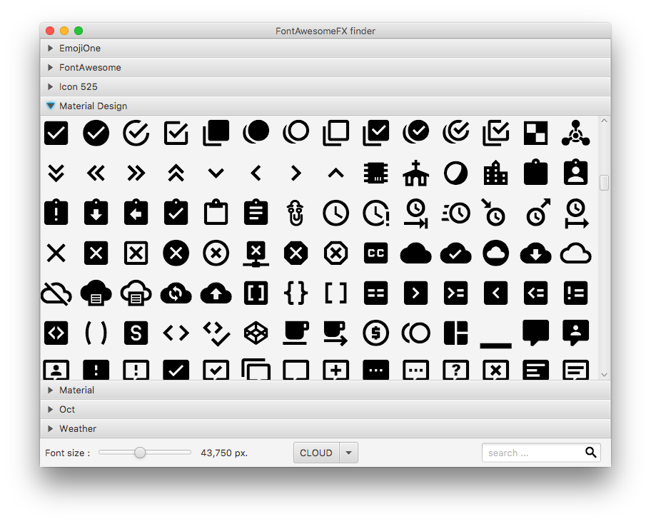
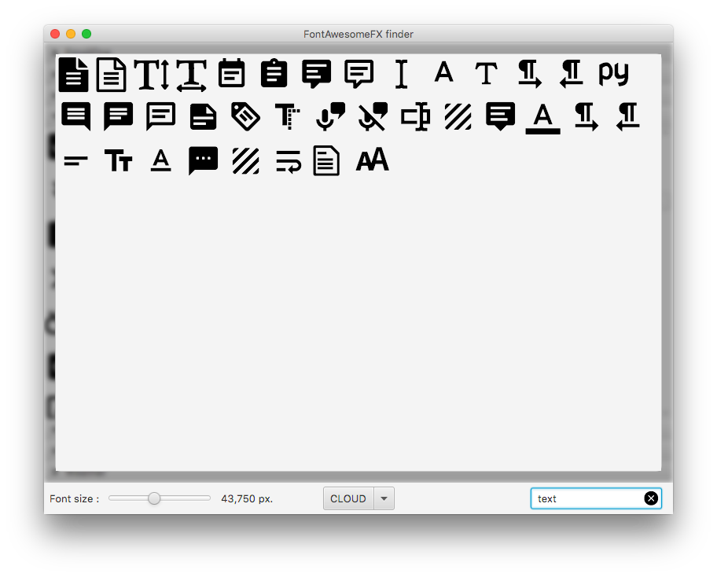

# fontAwesomeFX-finder
**Presentation**

A simple and efficient JavaFx viewer for the FontAwesomeFX library by [
Jerady](link=https://bitbucket.org/Jerady).
This lib allow you to use a lots a différents icons font in your JavaFx project (like FontAwesome, EmojiOne, Icon 525, ...).

Examples:

##Details
This project is a good sample for a Maven Java 8 / JavaFx sample, with a Maven configuration for FontAwesomeFX use.

##TODO

- [ ] Improve performances
- [ ] Add copy actions (like, copy for fxml, copy for class, ...)
